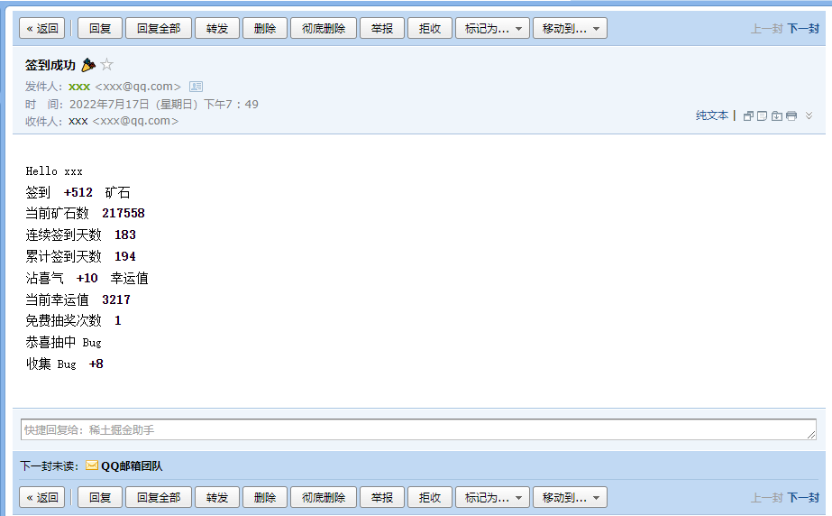
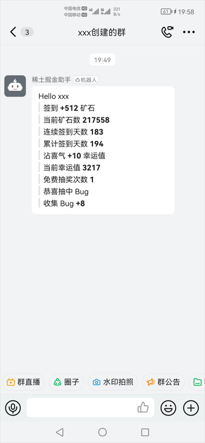
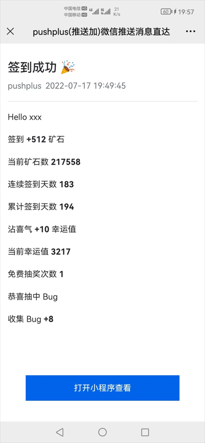

  

<h1 align="center">稀土掘金助手</h1>

  
  
  

## 简介

&emsp;&emsp;依赖 [GitHub Actions](https://docs.github.com/cn/actions/learn-github-actions/understanding-github-actions) 的稀土掘金助手，用于自动化每日签到、沾喜气、免费抽奖、`BugFix`等。

> 为保证脚本更好的运行，`Fork`仓库后请根据 [指南](https://juejin.cn/post/7108615649777156104#heading-13) 手动启用一次

## 使用

### 环境机密 Secrets

| `Name` | `Value` | `Required` |
| --- | --- | --- |
| `COOKIE` | 稀土掘金用户`cookie` | 是 |
| `EMAIL` | 邮箱地址 | 否 |
| `AUTHORIZATION_CODE` | 邮箱`POP3/SMTP`服务授权码 | 否 |
| `DINGDING_WEBHOOK` | 钉钉机器人`Webhook` | 否 |
| `PUSHPLUS_TOKEN` | 微信公众号`pushplus` `token` | 否 |

### 效果预览

 

    
    
  

## 第三方插件

* [nodemon](https://github.com/remy/nodemon)
* [node-fetch](https://github.com/node-fetch/node-fetch)
* [nodemailer](https://github.com/nodemailer/nodemailer)