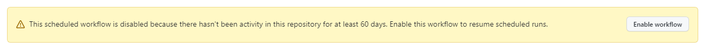
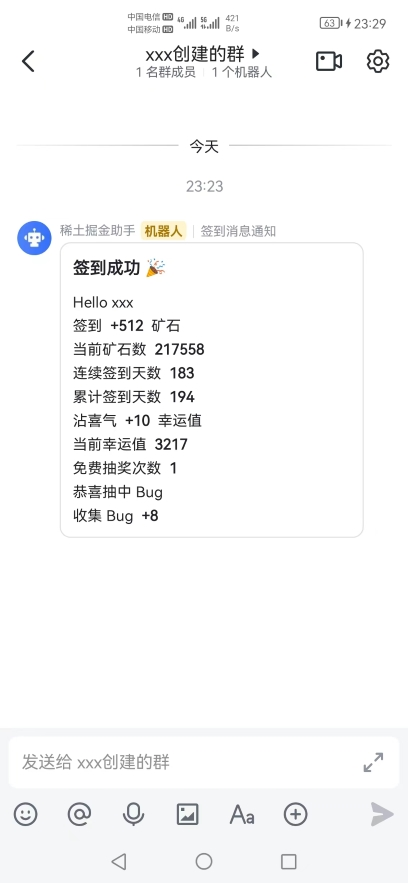

  

<h1 align="center">稀土掘金助手</h1>

  
  
  

## 简介

&emsp;&emsp;依赖 [GitHub Actions](https://docs.github.com/cn/actions/learn-github-actions/understanding-github-actions) 的稀土掘金助手，用于自动化每日签到、~~沾喜气~~、免费抽奖、<s><code>BugFix</code></s>等。

> 为保证脚本更好的运行，`Fork`仓库后请根据 [指南](https://juejin.cn/post/7108615649777156104#heading-14) 手动启用一次

## 异常

&emsp;&emsp;若仓库在`60`天内如果没有活动，工作流将被禁止，暂停签到。请手动点击`Enable workflow`以再次启用工作流。

  

## 使用

### 环境机密 Secrets

| `Name` | `Value` | `Required` |
| --- | --- | --- |
| `COOKIE` | 稀土掘金用户`cookie` | 是 |
| `EMAIL` | 邮箱地址 | 否 |
| `AUTHORIZATION_CODE` | 邮箱`POP3/SMTP`服务授权码 | 否 |
| <s><code>PUSHPLUS_TOKEN</code></s> | 微信公众号`pushplus` `token` | 否 |
| `DINGDING_WEBHOOK` | 钉钉机器人`Webhook` | 否 |
| `FEISHU_WEBHOOK` | 飞书机器人`Webhook` | 否 |

### 效果预览

 

    
    
    
  

## 第三方插件

* [puppeteer](https://github.com/puppeteer/puppeteer)
* [axios](https://github.com/axios/axios)
* [nodemailer](https://github.com/nodemailer/nodemailer)

## 免责声明

此服务仅为技术交流和个人学习目的而提供，使用即视为您已阅读并同意以下免责条款：
 
* 严禁用于任何商业目的。若因违反此规定而产生的任何法律责任，均由使用者自行承担，作者不承担任何商业法律责任
* 服务可能存在潜在风险，包括但不限于数据损坏、安全漏洞等。使用者应自行评估风险并承担因使用此服务而导致的一切后果